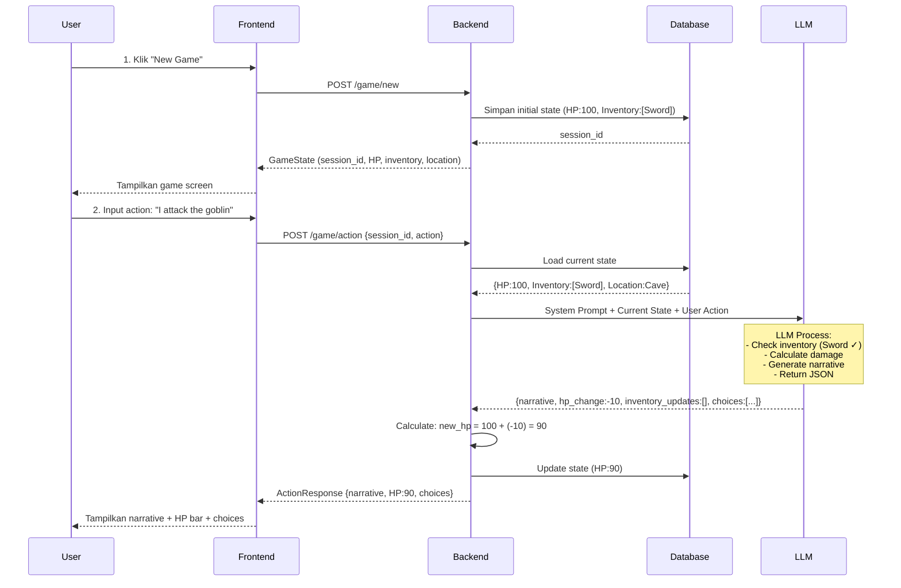

#  AI Driven Dungeon - Penjelasan Alur Sistem

##  Diagram Alur Lengkap



##  Alur Detail Step-by-Step

### **Step 1: User Memulai Game Baru**

```
User → Frontend: Klik "Start New Game"
Frontend → Backend: POST /game/new
Backend:
  1. Generate session_id (UUID)
  2. Create initial state:
     - HP: 100
     - Inventory: ["Rusty Sword"]
     - Location: "Dark Cave"
     - History: "You wake up in a dark cave..."
  3. Save to database
  4. Return GameState
Frontend: Tampilkan game UI dengan HP bar, inventory, location
```

### **Step 2: User Melakukan Aksi**

```
User → Frontend: Input "I attack the goblin"
Frontend → Backend: POST /game/action
Backend:
  1. Load current state from database
  2. Validate session exists
  3. Check if game_over = false
  4. Prepare LLM request:
     - System Prompt (aturan ketat)
     - Current State (HP, inventory, location, history)
     - User Action
```

### **Step 3: LLM Memproses Aksi**

```
Backend → LLM: Send request
LLM Process (Internal):
  1. Read System Prompt rules
  2. Check Current Inventory: ["Rusty Sword"] ✓
  3. User wants to attack → Valid action
  4. Calculate outcome:
     - Player hits goblin
     - Goblin fights back
     - Damage: -10 HP
  5. Generate narrative (max 3 sentences)
  6. Suggest 3 choices
  7. Return STRICT JSON (no markdown, no extra text)

LLM → Backend: 
{
  "narrative": "You swing your rusty sword...",
  "hp_change": -10,
  "inventory_updates": [],
  "new_location": null,
  "choices": ["Attack again", "Defend", "Run"],
  "game_over": false
}
```

### **Step 4: Backend Memproses Response LLM**

```
Backend receives LLM response:
  1. Parse JSON
  2. Validate structure
  3. Calculate new HP:
     current_hp = 100
     hp_change = -10
     new_hp = max(0, 100 + (-10)) = 90
  
  4. Update inventory:
     current_inventory = ["Rusty Sword"]
     inventory_updates = []
     new_inventory = ["Rusty Sword"]
  
  5. Update location:
     new_location = null → keep "Dark Cave"
  
  6. Update history:
     old_history + "\n\nPlayer: I attack the goblin\n" + narrative
  
  7. Check game over:
     game_over = false AND new_hp > 0 → Continue
  
  8. Save to database
  9. Return ActionResponse
```

### **Step 5: Frontend Menampilkan Hasil**

```
Frontend receives ActionResponse:
  1. Update HP bar: 100 → 90 (animate)
  2. Display narrative in story box
  3. Update inventory display
  4. Update location label
  5. Show 3 choice buttons
  6. If game_over = true → Show "Game Over" screen
```

##  Kenapa System Prompt Ini "Ketat"?

###  **Tanpa System Prompt Ketat:**
```
User: "I use my bazooka"
LLM: "Sure! You pull out your bazooka and destroy the cave. 
      You now have 200 HP and found a dragon egg!"
```
**Masalah:**
- User tidak punya bazooka di inventory
- HP naik tanpa alasan
- Item muncul dari nowhere

###  **Dengan System Prompt Ketat:**
```
User: "I use my bazooka"
LLM Response:
{
  "narrative": "You reach for a bazooka, but realize you don't have one. 
                You feel foolish standing there empty-handed.",
  "hp_change": 0,
  "inventory_updates": [],
  "new_location": null,
  "choices": ["Use your sword instead", "Look for weapons", "Run away"],
  "game_over": false
}
```
**Keuntungan:**
- LLM check inventory terlebih dahulu
- Narasi logis (user tidak punya item)
- Tidak ada perubahan HP/inventory yang tidak masuk akal

##  Fitur Anti-Halusinasi

### 1. **Inventory Consistency Check**
```python
# Di System Prompt:
"Check the Current Inventory. User CANNOT use items they do not have."

# Contoh:
Current Inventory: ["Rusty Sword"]
User Action: "I drink a health potion"
LLM Response: "You search your pockets but find no potion. hp_change: 0"
```

### 2. **Math Delegation**
```python
# LLM hanya return DELTA, bukan hasil akhir
LLM: {"hp_change": -15}  # LLM bilang "kurangi 15"
Backend: new_hp = max(0, current_hp + hp_change)  # Python yang hitung

# Kenapa? LLM buruk dalam matematika!
```

### 3. **Death Condition Enforcement**
```python
# Di System Prompt:
"If Current HP + hp_change <= 0, you MUST set game_over: true"

# Backend juga double-check:
game_over = llm_result["game_over"] or new_hp <= 0
```

### 4. **God Mode Prevention**
```python
# Di System Prompt:
"If user tries impossible things, narrate a failure or funny consequence."

User: "I fly to the moon"
LLM: "You flap your arms vigorously but remain firmly on the ground. 
      A nearby goblin laughs at you. hp_change: 0"
```

##  Struktur Data Flow

```
┌─────────────┐
│   User      │
│  "Attack!"  │
└──────┬──────┘
       │
       ▼
┌─────────────────────────────────────────┐
│  Frontend (React)              │
│  - Collect user input                   │
│  - Send to backend                      │
│  - Display response                     │
└──────┬──────────────────────────────────┘
       │ POST /game/action
       │ {session_id, action}
       ▼
┌─────────────────────────────────────────┐
│  Backend (FastAPI)                      │
│  1. Load state from DB                  │
│  2. Call LLM with strict prompt         │
│  3. Parse JSON response                 │
│  4. Calculate new HP/inventory          │
│  5. Save to DB                          │
│  6. Return result                       │
└──────┬──────────────────────────────────┘
       │
       ├─────────────┐
       │             │
       ▼             ▼
┌─────────────┐  ┌──────────────────────┐
│  Database   │  │  LLM (OpenAI)        │
│  (SQLite)   │  │  - Process action    │
│             │  │  - Return JSON       │
│  Sessions:  │  │  - Follow rules      │
│  - HP       │  └──────────────────────┘
│  - Inventory│
│  - Location │
│  - History  │
└─────────────┘
```

##  Keamanan Data

1. **Session Isolation**: Setiap user punya `session_id` unik (UUID)
2. **State Validation**: Backend selalu validasi state sebelum proses
3. **HP Bounds**: HP tidak bisa negatif (`max(0, new_hp)`)
4. **Game Over Lock**: Jika game_over=true, tidak bisa proses aksi lagi

##  Next Steps

Setelah backend siap, langkah selanjutnya:

1. **Test Backend**: Jalankan `python test_api.py`
2. **Build Frontend**: Buat UI untuk interact dengan API
3. **Integration**: Hubungkan frontend dengan backend
4. **Deploy**: Deploy ke server (Heroku, Railway, dll)

---

**Dokumentasi ini menjelaskan KENAPA sistem dirancang seperti ini, bukan hanya BAGAIMANA cara kerjanya.**
